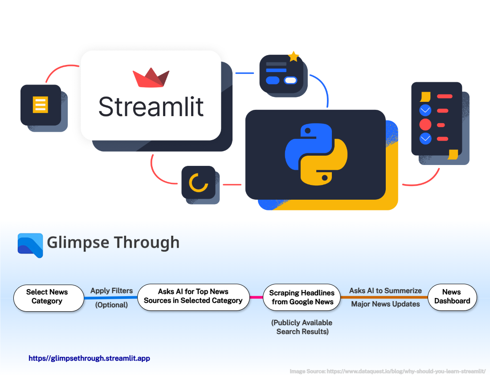

# Glimpse Through: AI-based-google-news-scraper

A Simple yet useful web application based on Streamlit called "𝗚𝗹𝗶𝗺𝗽𝘀𝗲 𝗧𝗵𝗿𝗼𝘂𝗴𝗵":  

⏩ Provides real-time insights into news articles across various domains  
⏩ Leverages AI and web scraping to deliver the most relevant news stories based on selected topics, regions, and user preferences  

Click the below link to try it out: 👇   
https://glimpsethrough.streamlit.app  
(𝘥𝘦𝘴𝘬𝘵𝘰𝘱 𝘰𝘯𝘭𝘺)  

𝘞𝘩𝘺 𝘵𝘩𝘪𝘴 𝘢𝘱𝘱?  
While AI chatbots like ChatGPT are incredibly powerful, they often fall short when it comes to delivering real-time updates. Although ChatGPT now supports real-time news, it still advises relying on credible news sources for the most current information. With this app, users get instant access to real-time news updates across a variety of topics, including Technology, Automobiles, Sports, the Stock Market, AI, and more. It can also be tailored with custom topic searches on virtually any subject—ranging from EVs, Crypto, and Real Estate to Anime, Tennis, Chess, and beyond.

𝘋𝘰𝘦𝘴 𝘎𝘰𝘰𝘨𝘭𝘦 𝘕𝘦𝘸𝘴 𝘢𝘭𝘭𝘰𝘸 𝘸𝘦𝘣 𝘴𝘤𝘳𝘢𝘱𝘪𝘯𝘨?  
Web scraping is often considered legally grey or restricted. However, Google News does permit scraping of certain sections, as outlined in its robots.txt file: https://news.google.com/robots.txt. It also offers RSS feeds, but these update every 30 minutes—which doesn’t meet the demand for truly real-time information. This app, however, only scrapes headlines from publicly accessible search results, strictly for display purposes, without storing or allowing redistribution.

𝘏𝘰𝘸 𝘥𝘰𝘦𝘴 𝘪𝘵 𝘸𝘰𝘳𝘬?  
The app uses Gemini and Mistral AI LLM APIs to identify top news sources and generate concise summaries. It scrapes headlines and thumbnails using libraries requests and bs4. It also incorporates HTML, JavaScript, and CSS elements to enhance interactivity. Thanks to advancements in web-based interactive frameworks or tools like Streamlit, Solara, Gradio, Dash, Panel, and Anvil have made it easier to rapidly build Python-based web applications.

𝘊𝘩𝘢𝘭𝘭𝘦𝘯𝘨𝘦𝘴 𝘢𝘯𝘥 𝘓𝘪𝘮𝘪𝘵𝘢𝘵𝘪𝘰𝘯𝘴  
While Streamlit is excellent for quick prototyping, it still doesn’t match popular front-end frameworks like React or Vue.js in terms of flexibility, smoothness and customization. Its layout and styling are relatively rigid, and also has speed issues, especially with reruns triggered by user interaction. Additionally, it lacks some basic configuration options—like setting a default browser zoom level. Despite these limitations, Streamlit remains a great platform to experiment, showcase scripts, and deliver functional apps quickly.

#ArtificialIntelligence #WebAppDevelopment #Python #Streamlit #WebScraping #LLM #AIApplications #GoogleNews #GenerativeAI #RealTimeNews #TechInnovation #SoftwareEngineering #OpenSource #BuildInPublic #DeveloperShowcase #LinkedInTech #AITools
